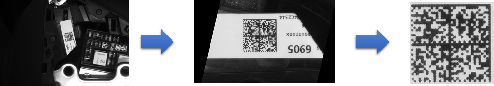

# Fuse-Detection


## 代码结构

1. detect.py  主程序
2. template.py  用于存放关于检测的函数（读取模板，模板匹配，检测保险丝）
3. img_process.py  用于存放图像处理的函数
4. scan_datamatrix.py 用于获取datamatrix码


image文件夹下存放待检测的图片和datamatrix码

template_image文件夹下有三个文件夹，分别是template_fuse，template_raw，template_roi，用于存放不同保险丝的模板（template_fuse），不同roi区域的模板（template_roi）

requirements：opencv-python,  multi-template-matching(1.6.4)


## 运行流程


### 1.图像校正与边缘提取


由上图所示，先将需要检测的图像截取保险丝盒的大致位置，方便后续处理。可以尝试锐化、gamma变换等方法对图像进行预处理，但多次尝试尝试过后效果一般，在二值化后会有噪声或者数字边缘不清晰的情况，所以我这边只用了一个简单的高斯滤波。

然后用**霍夫变换**检测保险丝盒边缘的直线，得到保险丝盒边缘直线与水平线的夹角，然后将图片旋转。旋转后运用canny算子提取边缘，用一个阈值很低的模板匹配提取出保险丝盒的区域并裁剪出待检测区域。


同理，datamatrix码也可以通过这样的方式截取出来。




### 2.模板匹配

提取出的保险丝上的数字模板被存放在template_fuse文件夹中，文件名称如下图所示，每个模板文件夹下有十个左右的模板，更多模板存放在template_raw 文件夹中。


利用readTemplates函数对所有模板进行读取，然后detect_fuse函数对图像进行**多模板匹配**，匹配时模板会旋转90°和180°来丰富模板的多样性，置信度score_threshold设置为0.45，可以发现整张图模板匹配的效果如下。


### 3.判断安装情况

如果要判断每个位置是否安装正确。则需要对每一个保险丝的位置进行切分，然后分别在每个小区域里做模板匹配。总的来说，保险丝盒可以划分为4行，第一行包括14个位置，第二行包括8个位置，第三、第四行包括4个位置。


具体划分的代码如下所示：

```python
"""划分第一行"""
width = image.shape[0]
length = image.shape[1]
length_unit = int(length / 15)
for i in range(14):
	result_line1 = image[0:int(width / 3.5), int(length_unit * (i + 0.3)): int(length_unit * (i + 1.7))]
```

在每个小区域检测后，判断该区域内是否有被识别出来的保险丝数字，如果没有，则输出'0'，如果有，则输出保险丝型号，如'10'，如果该区域有多个保险丝，那么说明识别出了问题，输出该位置为'X'，并打印报错信息例如：Error! 2 outcomes in location line1_8 ['2', '5']。

```python
[['20', '5', '0', '10', '30', '20', '10', '2', '0', '0', '5', '15', '15', '5'],
 ['10', '10', '5', '5', '0', '30', '0', '0'],
 ['5', '15', '30', '10'],
 ['5', '0', '20', '10']]
```

也可以转换为另一种形式，该位置上安装了保险丝表示为1，未安装保险丝表示为0.

```python
[[1, 1, 0, 1, 1, 1, 1, 1, 0, 0, 1, 1, 1, 1],
 [1, 1, 1, 1, 0, 1, 0, 0],
 [1, 1, 1, 1],
 [1, 0, 1, 1]]
```

最后利用这两个输出列表和预先设置好的保险丝安装零件对应列表进行比较，则可以判断是否漏装。

在经过49张图片测试之后，发现仅有2张图片分别漏检一个位置，**漏装检测正确率为95.9%**。

但在具体位置型号的判别上偶尔会出现错检，如将‘10’判别为‘2’，‘20’判别为‘30’，正确率需要进一步改善。


### 4.其他方法

另外，我也尝试了运用YOLOv5训练检测模型（200epoch, batch_size = 8），对于相关区域进行检测。由于训练数据不足（五十张图片左右，每张图上标注30个boundingbox），可以看出bounding_box定位比较精准，漏检错检的情况比较严重，训练的train_obj_loss收敛情况不佳，如果数据集多一些，效果相应地会改善。

​                


此外，使用ocr的方法检测如 paddleocr 和 easyocr 对于保险丝的字体效果一般，有漏检的情况，需要训练相应的字体库。
